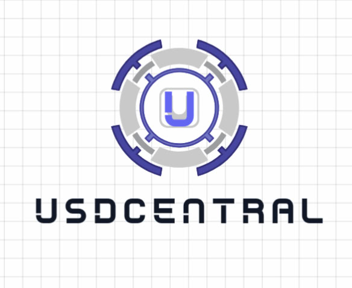
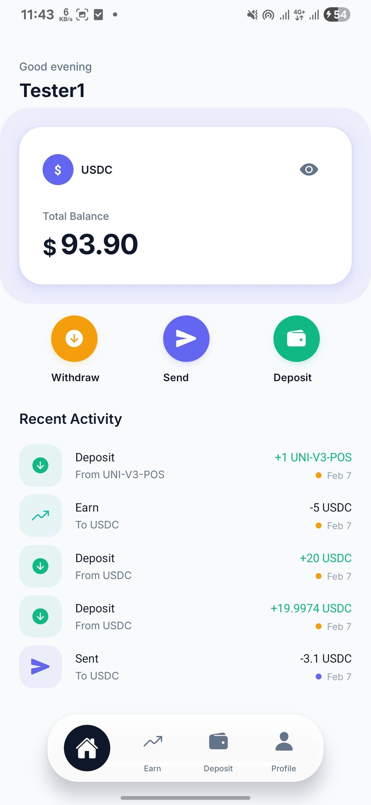
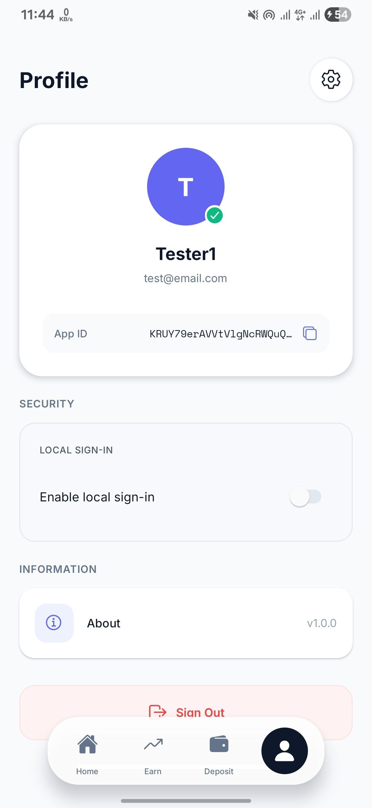
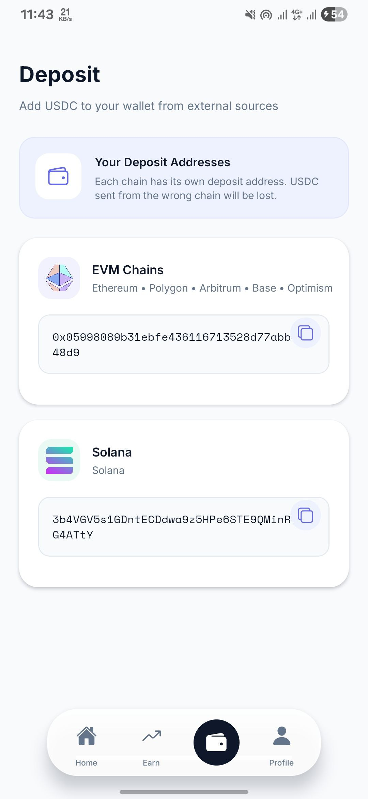
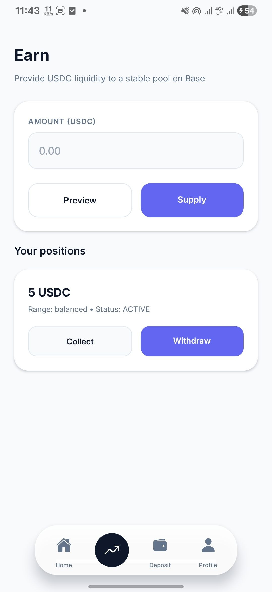
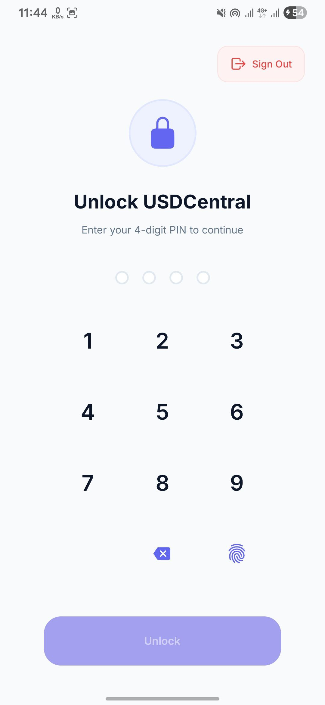
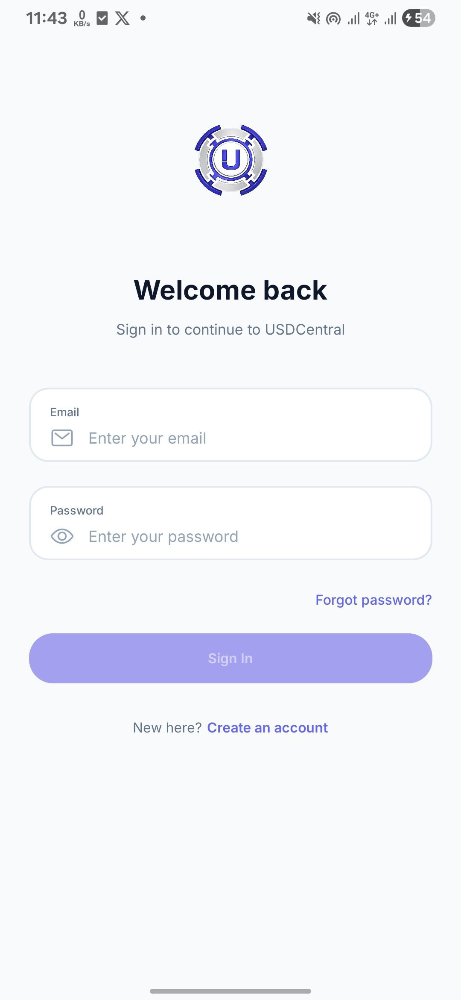
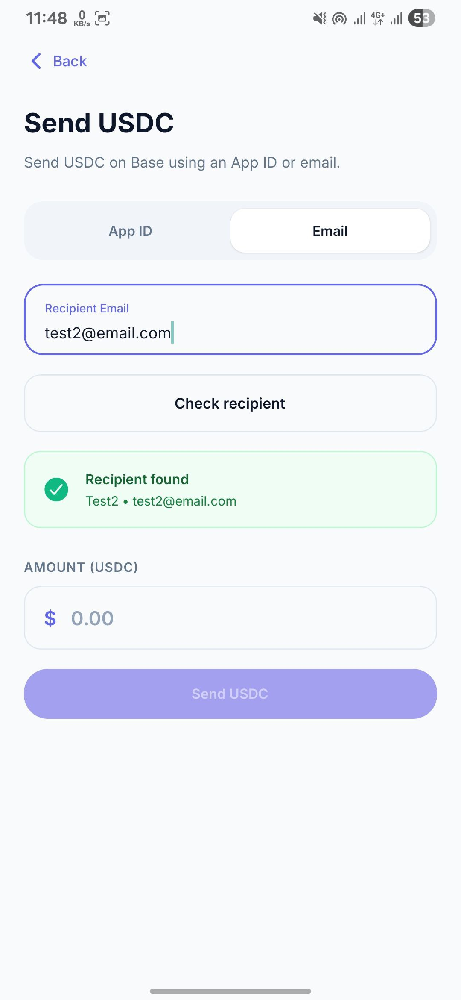

  
  <h1>USDCentral</h1>
  
<b>Your stablecoins, simplified. No crypto-degree required.</b>

---

##  What is USDCentral?

USDCentral is all about making stablecoins easy for everyone. I built it because managing USDC across a dozen different chains is a headache for most people. With USDCentral, all that "chain" stuff happens in the background. You just manage your money and Earn on your stable.

**Built for the ETH Global Hackathon 2026!** 🚀

### What can you do?
- **Manage everything in one place**: No matter what chain your USDC is on, it just shows up as your balance.
- **Earn Yield**: Put your money to work.
- **Send & Move**: Send USDC to friends or move it to your other wallets without sweating about gas fees or bridge jargon.
- **Just Work**: You don't need to know how the plumbing works to use it.

---

##  A look inside

  <table style="border: none;">
    <tr>
      <td width="30%"></td>
      <td width="30%"></td>
      <td width="30%"></td>
    </tr>
  </table>

<b>View More Screens</b>

 

  
  
  
   
  

---

##  The Tech Stuff

### Backend
- **Core**: Node.js & TypeScript
- **Wallet**: Powered by **Circle Developer Controlled Wallets** 
- **Database**: Firebase 
- **Moving Parts**: CCTP, and **LI.FI** for auto-swapping any token to USDC during deposits (only mainnet)
- **Earn** : Curve Finanace

### Mobile
- **Frame**: React Native (Expo) 

---

##  What's Next?
- **On-ramp & Off-ramp**: Making it possible to buy USDC with your bank account and withdraw it back to real-world cash directly in the app.

---

##  Want to run it?

1.  **Clone the repo**
2.  **Backend Setup**:
    - `cd backend`
    - Copy `.env.example` to `.env` and fill in your Circle and Firebase credentials.
    - `npm install && npm run dev`
3.  **Webhook Setup (Important!)**:
    - Use **ngrok** to tunnel your local backend port (usually 3000): `ngrok http 3000`.
    - Copy your ngrok URL and add it as the Webhook URL in your **Circle Console Dashboard**.
4.  **Mobile Setup**:
    - `cd mobile-app`
    - `npm install`
    - `npx expo start`
